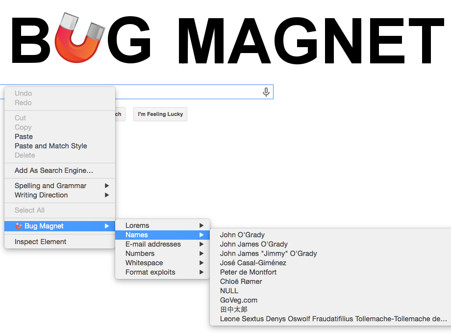

Exploratory testing assistant for Chrome and Firefox. Adds common problematic values and edge cases to the context menu (right-click) for editable elements, so you can keep them handy and access them easily during exploratory testing sessions.  

## Features

* Convenient access to common boundaries and edge cases for exploratory testing
* Extend it with your own config files easily
* Works on input fields, text areas, content editable DIVs
* Works on multi-frame pages, but only if they are from the same domain
* Works in Chrome and Firefox
* Tiny overhead per page (<1k), no 3rd party library dependencies, completely passive, so it does not interfere with your web app execution in any way

## Usage

The easiest way to install the extension is from the [Chrome Web store](https://chrome.google.com/webstore/detail/efhedldbjahpgjcneebmbolkalbhckfi) or [Mozilla Add-ons](https://addons.mozilla.org/en-US/firefox/addon/bug-magnet/).

After installation, just right-click on any editable item on the page and you'll see a Bug Magnet submenu. Click an item there, and it will be inserted into the editable field. 

## More infomation 

* [What's new in the latest version?](https://bugmagnet.org/v3.html)
* [How to install and use BugMagnet?](https://bugmagnet.org/using.html)
* [How to contribute or support development?](https://bugmagnet.org/contributing.html)
* [How to customise menus?](https://bugmagnet.org/customising.html)
* [Developer Guide](CONTRIBUTING.md)
* [Resources about edge cases in BugMagnet menus](https://bugmagnet.org/resources.html).

## Authors 

* [Gojko Adzic](https://gojko.net) 
* [@bbbco](http://twitter.com/bbbco) (old Firefox Addon)

----

## Icon credit

Magnet icon from [Woothemes Ultimate Icon Set by Nishan Sothilingam](http://iconfindr.com/1vSsaKB)
